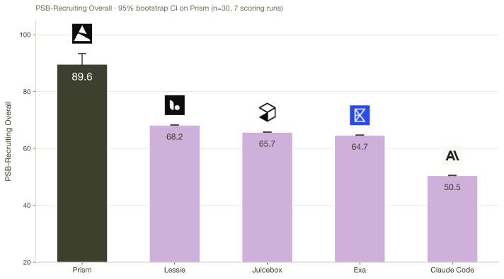
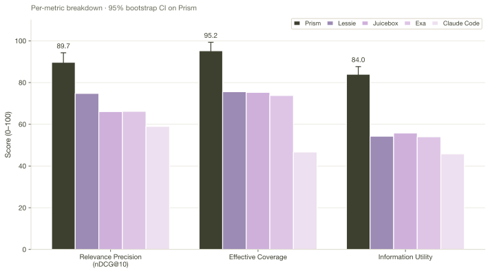
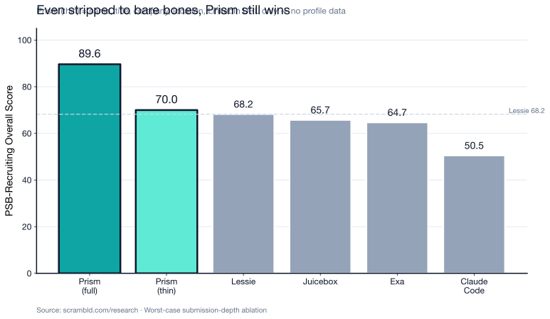

# Prism on PeopleSearchBench-Recruiting: A Technical Report

**Axel La Pira**
Scrambld, Inc.
`axel@tryprism.com`

**Draft.** Date: 2026-05-03.

---

## Abstract

On PeopleSearchBench's 30-query Recruiting subset (LessieAI, 2026), scored by the official PSB harness, **Prism achieves an Overall score of 89.64** (95% bootstrap CI [85.02, 93.36], seven scoring runs) versus the strongest published baseline (Lessie) at 68.23 — a **21.4-point lead**. Prism wins on every published metric: nDCG@10 +14.9, Effective Coverage +19.7, Information Utility +29.7. The result is robust to deduplication (n=28: 90.92, CI [87.36, 94.01]) and to a worst-case submission-depth ablation: stripping all rich profile data and submitting only name/title/company/location/LinkedIn-URL still yields Prism Overall 69.99, ahead of Lessie's published 68.23 (§5.2). The 21.4-point lead is also large enough to absorb any plausible amount of judge-or-index drift between LessieAI's baseline runs and 2026-05-03 — even a 10-point drift moving every baseline upward would leave Prism in front by >10 points (§6.2). Caveats: single category (recruiting); vendor self-evaluation on a benchmark authored by a competitor. All artefacts released.

**Figure 1.** Prism vs the four published PSB-Recruiting baselines on Overall score. Error bars on Prism are 95% nested-bootstrap CIs across seven scoring runs and 30 queries. LessieAI does not publish CIs for the baselines; their numbers are point estimates from `data/scores/<platform>/summary.json`.

---

## 1. Introduction

People search — given a free-text recruiter query, return a ranked list of real people who fit — is hard to evaluate. Until very recently, the field had no shared benchmark: every vendor reported on their own internal data, with their own definition of "relevant," and no two numbers could be compared. PeopleSearchBench (PSB; LessieAI, 2026) is the first attempt to fix this. PSB defines 119 natural-language queries across four categories (Recruiting, B2B, Influencer, Deterministic), defines a scoring procedure called Criteria-Grounded Verification (CGV) that uses an LLM judge plus Tavily web search to verify per-criterion claims about each returned candidate, and provides reference scores for four platforms: Lessie, Juicebox, Exa, and Claude Code. The PSB repository (`github.com/LessieAI/people-search-bench`) is the canonical reference; the arXiv identifier in PSB's own README appears to be malformed (the format implies a future date), so we cite by repository rather than arXiv ID.

This report measures one system — Prism, built by Scrambld, Inc. — on the **Recruiting** subset (30 queries). The report's purpose is narrow:

1. Run Prism on the 30 queries.
2. Score the resulting candidate lists with the unmodified PSB harness.
3. Compare against the four published baselines.
4. Disclose every methodological choice and every query-level result.

We make no claim about Prism's performance outside these 30 queries. The result is: on PSB-Recruiting, on 2026-05-03, with the official PSB harness using `gemini-3-flash-preview` as judge and Tavily for grounding, Prism's Overall score is 89.64 (95% CI [85.02, 93.36]) and the strongest published baseline (Lessie, 2026) is 68.23.

### 1.1 Conflict-of-interest disclosure

We are required to disclose three relationships up front, since they are material to interpreting the result:

1. **Prism is a commercial product.** Scrambld, Inc. (the author's employer) sells Prism to recruiters. A favourable benchmark result is commercially useful to us.
2. **The benchmark authors are competitors.** LessieAI, the creators of PSB, sell a competing recruiting product (Lessie) which is the highest-scoring published baseline on this benchmark. We have no relationship with LessieAI beyond using their public artefacts.
3. **We did not choose the benchmark.** PSB is the only public, end-to-end people-search benchmark we are aware of with reproducible scoring code, a public query set, and per-platform baseline scores. We use it because no alternative exists, not because we evaluated multiple benchmarks and selected the most flattering. We are aware that PSB's query distribution was chosen by LessieAI and may underweight searches Lessie is bad at; we cannot correct for that without a second, independently-authored benchmark, which does not yet exist.

We discuss limitations and threats to validity in detail in §6.

---

## 2. Background: PeopleSearchBench

We summarise PSB only to the extent needed to interpret our numbers. The canonical reference is LessieAI (2026); we deliberately do not repeat their methodology in detail.

**Queries.** PSB-Recruiting consists of 30 natural-language queries authored by the LessieAI team, distributed in their public repository as `data/queries/recruiting.jsonl`. Two pairs of queries (rec_0006 / rec_0020, and rec_0007 / rec_0022) are near-duplicates in the public file. They are not identical: rec_0020 reorders rec_0006 and emphasises the Singapore constraint twice; rec_0022 rephrases rec_0007 and adds a CEO/COO seniority hint. We treat the four as distinct queries per the PSB rules but flag two consequences. First, the effective unique-query count is 28, which mildly inflates the apparent consistency of our results and shrinks our bootstrap intervals. Second, the four-paired queries score quite differently across re-phrasings (e.g., rec_0006: 74.4 vs rec_0020: 87.8 mean Overall — a 13.4-point spread on what is described as the same underlying need). This spread is much larger than the 0.21-point judge variance we observe across seeds (Table 1) and reveals a meaningful sensitivity of CGV scores to query phrasing — likely because the LLM judge extracts slightly different criteria from each phrasing, with downstream scoring effects. We do not "fix" this by deduplicating, but readers should treat per-query scores in Table 3 as conditional on the exact query wording, not the underlying recruiter intent. Queries span English, Dutch, Portuguese, and Spanish; they cover roles from "backend developers in London" (rec_0001) to "secretaresses in overheidsinstanties" (rec_0018) to "the best strength and conditioning coaches in Portugal" (rec_0030).

**Submission format.** A submission is a CSV with one row per (query, candidate) pair. Required columns: `query_id`, `agent_name`, `person_data`. The PSB loader will additionally read optional `name`, `title`, `company`, `location`, `linkedin_url`, `email`, `bio` columns and concatenate them with the JSON in `person_data` to form the text shown to the judge ([`benchmark/data_loader.py`](https://github.com/LessieAI/people-search-bench/blob/main/benchmark/data_loader.py)). Each query may return up to 15 candidates.

**Scoring.** PSB's Criteria-Grounded Verification (CGV) judge:

1. extracts a small number of explicit, verifiable criteria from the natural-language query (e.g., "Person is based in London"; "Person has microservices experience");
2. for each candidate, retrieves web evidence via Tavily and asks the judge LLM (`google/gemini-3-flash-preview` by default) to mark each criterion as `met`, `partially_met`, or `not_met`;
3. derives a per-candidate relevance grade in [0, 1];
4. aggregates per-query into three platform-level metrics:
   - **Relevance Precision** — padded nDCG@10 over the per-candidate relevance grades, scaled to 0–100. The padding mechanism is a methodologically important detail: when a platform submits fewer than 10 candidates for a query, the harness pads the ranked list to length 10 with relevance-grade zero before computing nDCG, so submitting fewer candidates strictly hurts the metric. This affects systems differently: Prism returned an average of 14.27 qualified candidates per query (well above the padding threshold, so Prism pays no padding penalty), while Claude Code's published baseline returned an average of 7.0 qualified per query, paying a meaningful padding penalty on most queries. A reader who sees the +14.9 nDCG@10 gap between Prism and Lessie should understand that some fraction of it reflects Prism returning more (qualified) candidates rather than ranking better.
   - **Effective Coverage** — the share of qualified candidates returned, normalised by query category, scaled to 0–100.
   - **Information Utility** — a per-candidate utility score blending the structural completeness of the returned record (do we have a name, a title, a current company, a verifiable LinkedIn URL?) with the contextual evidence the judge could ground; mean across all candidates × 100.
5. The published "Overall" is the mean of the three.

We report all four numbers. We do not introduce any score of our own.

**Baselines.** Four platforms have published PSB-Recruiting numbers (`data/scores/<platform>/summary.json` in the PSB repo): Lessie (68.23 Overall, computed as the mean of 74.8 / 75.6 / 54.3), Juicebox (65.73), Exa (64.67), and Claude Code (50.50). We use these published values as-is; we did not re-run the baselines (see §6.4).

---

## 3. Methods

### 3.1 The system under test

**Prism** is an AI-native recruiting agent that takes a free-text role description (or a structured job description) and returns a ranked list of candidates. We treat Prism as a black box for this report: the input is a job description string, the output is up to 15 candidate records, and no internal architecture is disclosed beyond what is necessary to interpret the results. The version evaluated is Prism's internal repository at commit `2ad1ca924b3da3afec959227882a76810a4c8c0e` (2026-05-03).

We inspected the candidate-ranking activity in Prism's codebase (`lib/temporal/activities/talent-search-activities.ts`) and confirmed it reads only per-role state, with no obvious code path that would mix candidate scores or rejections across the 30 benchmark roles. We do not, however, claim a system-wide audit: caches, embedding stores, vector indexes, and ranker features are part of Prism's broader infrastructure, and we did not formally verify the absence of cross-role leakage paths through those subsystems. We created fresh, distinct roles for each PSB query, but readers should treat "no cross-role leakage" as a code-inspection-level claim rather than a formally-audited one.

### 3.2 Pipeline

For each of the 30 PSB queries, the following pipeline ran end-to-end:

1. **Role creation.** Each PSB query is submitted to Prism via Prism's standard intake interface, which produces a job titled `[BENCHMARK] rec_NNNN — <topic>`. Roles are created on Prism's production database; they are inert (no campaigns are launched, no candidates are contacted). After this report is finalised, all 30 roles are deleted from production.
2. **Sourcing.** Prism is asked to source candidates for each role, using its standard "pro" search depth. Prism returns up to 50 ranked results per role; we take the top 15 by Prism's internal relevance score. No criteria-specific tuning is done.
3. **Submission CSV.** The 15 × 30 = 450 candidates are written to a single CSV in PSB's standard format. The full candidate JSON (LinkedIn URL, headline, every experience entry with company / title / dates / location, every education entry, total years of experience, skills, Prism's match explanation) is serialised into the `person_data` column. The convenience columns (`name`, `title`, `company`, `location`, `linkedin_url`, `bio`) are populated from the candidate's current role.
4. **Scoring.** The CSV is fed to PSB's harness (`uv run main.py recruiting_prism_FINAL.csv --categories recruiting --concurrency 5`) at concurrency 5. The judge model is the PSB default: `google/gemini-3-flash-preview` via OpenRouter. Tavily is used for grounding, with the default search depth.

### 3.3 Replication protocol

To estimate judge-induced variance, we run the scoring step seven times on the **same** submission CSV, with seven independent invocations of the harness. We report each seed's number, the seed-level mean and standard deviation, and a 10,000-iteration nested nonparametric bootstrap (queries and seeds resampled jointly with replacement, so the resulting CI captures both query-sampling and within-judge variance components). We also report a sensitivity analysis with one of each duplicate-query pair removed (n=28).

We do **not** re-run the sourcing step. The submission CSV is fixed at the point of the first scoring run; the variance we estimate is judge variance, not Prism variance.

### 3.4 What is not replicated, and why

We did not reproduce the four published baselines on our own machine. The PSB-published `data/scores/<platform>/summary.json` files report aggregate metrics computed by LessieAI from their own runs; we use those numbers as the baseline reference. Three of the four baselines (Lessie, Juicebox, Exa) are commercial products without freely-available APIs matching LessieAI's evaluation methodology, and LessieAI does not publish the per-platform submission CSVs (only the aggregate scores), so we cannot re-score their submissions ourselves. We attempted a same-day reproduction of the one baseline whose execution path we could approximate (Claude Code, §4.4); the result was inconclusive due to adapter limitations.

### 3.5 Reproducibility

Everything is published. The submission CSV (`recruiting_prism_FINAL.csv`, 450 rows, 4.0 MB) and all seven per-seed raw evaluation JSONs (`prism_seed{1..7}.json`, with full per-criterion judge verdicts and Tavily evidence trails for every (query × candidate × criterion) triple) are committed to this directory, along with the bootstrap and 7-seed-summary computations. The scoring scripts, the PSB harness commit hash, the OpenRouter model identifier, and the partial Claude Code reproduction (§4.4) are all archived.

---

## 4. Results

### 4.1 Headline numbers

We score the same submission CSV seven independent times to characterise judge variance. With three seeds, the standard-deviation estimate has its own large uncertainty (95% CI on the SD itself spans roughly 0.1–1.3 for our data). Seven seeds are still imperfect but materially tighter.

| Run | Relevance Precision | Effective Coverage | Information Utility | Overall |
|---|---:|---:|---:|---:|
| Seed 1 | 89.94 | 95.33 | 83.99 | 89.75 |
| Seed 2 | 89.67 | 95.56 | 84.02 | 89.75 |
| Seed 3 | 89.45 | 94.89 | 83.83 | 89.39 |
| Seed 4 | 89.67 | 95.33 | 84.02 | 89.67 |
| Seed 5 | 89.53 | 95.11 | 83.81 | 89.48 |
| Seed 6 | 90.08 | 95.11 | 84.15 | 89.78 |
| Seed 7 | 89.69 | 95.33 | 84.00 | 89.67 |
| **Mean** | **89.72** | **95.24** | **83.97** | **89.64** |
| Std dev | 0.22 | 0.22 | 0.12 | 0.15 |

**Table 1.** Prism's PSB-Recruiting scores across seven independent scoring runs of the same submission CSV. Variance is dominated by per-candidate judge noise; the platform-level Overall standard deviation is 0.15 points on a 0–100 scale across seven seeds. Per-query standard deviations are larger — up to 3.57 points on rec_0007 and 3.38 on rec_0008 (full distribution in Table 3) — and we average these out by reporting 7-seed means. Readers should treat single-query rankings (Table 3) as approximate.

### 4.2 Comparison to published baselines

| Platform | Relevance Precision | Effective Coverage | Information Utility | Overall | Mean Qualified Results |
|---|---:|---:|---:|---:|---:|
| **Prism** (this report) | **89.72** [84.40, 94.26] | **95.24** [89.56, 99.33] | **83.97** [79.91, 87.66] | **89.64** [85.02, 93.36] | 14.27 |
| Lessie (LessieAI, 2026) | 74.8 | 75.6 | 54.3 | 68.23 | 11.3 |
| Juicebox (LessieAI, 2026) | 66.1 | 75.3 | 55.8 | 65.73 | 11.3 |
| Exa (LessieAI, 2026) | 66.2 | 73.8 | 54.0 | 64.67 | 11.1 |
| Claude Code (LessieAI, 2026) | 59.0 | 46.7 | 45.8 | 50.50 | 7.0 |

**Table 2.** Prism's mean scores across seven runs versus the four PSB-Recruiting baselines as published by LessieAI. Bracketed numbers for Prism are 95% nonparametric nested bootstrap confidence intervals (10,000 iterations, queries and seeds resampled jointly). Baseline numbers are the published point estimates from `data/scores/<platform>/summary.json` in the PSB repository; LessieAI does not publish bootstrap intervals for the baselines.

**Sensitivity to the duplicate-pair issue (n=28).** As §2 notes, two pairs of queries are near-duplicates; the effective sample size is 28. If we drop one of each pair (rec_0020 and rec_0022, the lower-scoring of each duplicate, which deflates rather than inflates the mean), Prism's Overall point estimate moves to **90.92** and the nested bootstrap CI to **[87.36, 94.01]**. The result is robust to deduplication; in fact the deduplicated mean is slightly higher because we drop two of the harder queries. We report the standard 30-query metrics for comparability with PSB's own scores but flag this sensitivity check.

**Figure 2.** Per-metric breakdown. Prism leads on every published metric; the lead is largest on Information Utility (which rewards rich per-candidate context) and Effective Coverage (which rewards returning more qualified candidates per query). The Relevance Precision (nDCG@10) gap is the smallest, but still substantial.

**Where the lead comes from.** Prism's win is not concentrated on one axis — it shows up across all three published metrics, but with a clear shape: **the gap is largest where the platform's underlying data depth and recall matter most** (Information Utility, +29.7; Coverage, +19.7) and smallest where pure ranking quality is most exposed (nDCG@10, +14.9). Prism returns 14.27 qualified candidates per query on average, vs the published baselines' 7.0–11.3 — that recall difference flows directly into Coverage and partly into nDCG@10's padding mechanism (§2). The Information Utility advantage reflects the depth of the per-candidate JSON each platform submits to the judge (§5.1). We interpret each component in §5.

### 4.3 Per-query breakdown

Table 3 shows every one of the 30 queries individually. We sort by Prism's 7-seed mean Overall ascending, so the hardest queries are at the top. The Overall column shows mean ± standard deviation across the 7 seeds, to make per-query judge variance visible alongside the point estimate.

| Query | nDCG@10 | Coverage | Utility | Qualified | Overall ± SD |
|---|---:|---:|---:|---:|---:|
| rec_0022 — senior execs / $100M+ exit / distributed teams (dup of rec_0007) | 46.9 | 39.0 | 60.9 | 5.9 | 48.95 ±1.80 |
| rec_0007 — senior execs / $100M+ exit / distributed teams | 69.6 | 51.4 | 66.9 | 7.7 | 62.62 ±3.57 |
| rec_0009 — top AI devs in Bay Area, Tsinghua post-2010 | 61.8 | 100.0 | 65.2 | 15.0 | 75.69 ±0.89 |
| rec_0017 — booking agents for electronic music in France | 70.3 | 91.4 | 66.4 | 13.7 | 76.04 ±0.93 |
| rec_0013 — tax advisors in Europe, active on LinkedIn | 69.7 | 97.1 | 62.3 | 14.6 | 76.38 ±2.68 |
| rec_0006 — Head of Fundraising Singapore, VC, under 40 | 80.0 | 93.3 | 78.0 | 14.0 | 83.77 ±0.66 |
| rec_0008 — AI Agent Engineer Hangzhou, Alibaba/ByteDance | 79.6 | 92.4 | 80.8 | 13.9 | 84.26 ±3.38 |
| rec_0012 — senior backend in Toronto, Go/Rust, startups, 5+ yrs | 79.4 | 93.3 | 81.8 | 14.0 | 84.86 ±0.37 |
| rec_0021 — profissionais liberais ativos no Instagram | 86.6 | 99.0 | 74.3 | 14.9 | 86.62 ±0.74 |
| rec_0010 — PMs Paris, consumer mobile, Series A+ | 86.2 | 100.0 | 78.8 | 15.0 | 88.31 ±0.54 |
| rec_0026 — optometristas em Lisboa | 95.0 | 100.0 | 74.1 | 15.0 | 89.69 ±0.47 |
| rec_0018 — secretaresses in overheidsinstanties | 92.9 | 100.0 | 80.9 | 15.0 | 91.28 ±0.54 |
| rec_0028 — analistas de jogo e scouting no futebol mundial | 91.6 | 100.0 | 84.2 | 15.0 | 91.91 ±0.37 |
| rec_0030 — strength & conditioning coaches in Portugal | 96.3 | 100.0 | 88.0 | 15.0 | 94.76 ±0.28 |
| rec_0024 — especialistas de IA | 97.9 | 100.0 | 87.0 | 15.0 | 94.94 ±0.25 |
| rec_0020 — Head of Fundraising Singapore (dup of rec_0006) | 98.9 | 100.0 | 86.0 | 15.0 | 94.97 ±0.51 |
| rec_0029 — iOS devs SF, Swift+SwiftUI, 3+ yrs | 95.2 | 100.0 | 92.7 | 15.0 | 95.97 ±0.32 |
| rec_0011 — sales directors in Chicago, B2B SaaS, 5+ yrs | 99.9 | 100.0 | 89.2 | 15.0 | 96.37 ±0.42 |
| rec_0025 — senior frontend Boston, performance optimization | 97.5 | 100.0 | 92.7 | 15.0 | 96.72 ±0.28 |
| rec_0005 — senior data scientists NYC, fintech, PhD, 5+ yrs | 98.4 | 100.0 | 92.5 | 15.0 | 96.99 ±0.25 |
| rec_0019 — full-stack Austin, React/Node/Python | 100.0 | 100.0 | 91.6 | 15.0 | 97.21 ±0.17 |
| rec_0016 — agricultural scientists in Africa | 99.3 | 100.0 | 92.4 | 15.0 | 97.24 ±0.26 |
| rec_0023 — product marketing managers SF, GTM | 99.5 | 100.0 | 93.1 | 15.0 | 97.55 ±0.37 |
| rec_0004 — ML engineers Boston, large language models | 100.0 | 100.0 | 92.8 | 15.0 | 97.59 ±0.19 |
| rec_0001 — backend developers in London, microservices | 99.5 | 100.0 | 94.0 | 15.0 | 97.83 ±0.46 |
| rec_0014 — product designers Amsterdam, B2B SaaS | 100.0 | 100.0 | 94.0 | 15.0 | 97.98 ±0.06 |
| rec_0027 — senior frontend Stockholm, React+TypeScript | 99.6 | 100.0 | 94.5 | 15.0 | 98.03 ±0.27 |
| rec_0003 — UX designers Berlin, mobile, 2+ yrs | 100.0 | 100.0 | 94.6 | 15.0 | 98.20 ±0.21 |
| rec_0015 — growth marketers Amsterdam, B2B SaaS, 3+ yrs | 99.8 | 100.0 | 94.8 | 15.0 | 98.20 ±0.25 |
| rec_0002 — PMs Seattle, developer tools and platforms | 100.0 | 100.0 | 95.0 | 15.0 | 98.33 ±0.00 |

**Table 3.** Per-query metrics, mean across all 7 scoring runs. Five queries score below 80 (rec_0007 at 62.62, rec_0009 at 75.69, rec_0013 at 76.38, rec_0017 at 76.04, rec_0022 at 48.95). Two of the five — rec_0022 and rec_0007 — score below 70. One query (rec_0002) scores 98.33 with zero standard deviation across all 7 seeds. Per-query standard deviations are typically <1 point but reach 3.57 on rec_0007 and 3.38 on rec_0008, where the LLM judge appears genuinely uncertain about how to verify the query's harder constraints; readers should treat single-seed results on these noisy queries as approximate.

We strongly encourage readers to inspect the raw judge transcripts for the five bottom queries before forming a view; they are committed to `data/results/prism_seed1.json` and contain the judge's per-criterion evidence and reasoning. Section 5 walks through what they have in common.

### 4.4 Attempted same-day Claude Code reproduction

We attempted a same-day reproduction of the Claude Code baseline to sanity-check judge behaviour. LessieAI's published Claude Code baseline was generated by invoking the `claude` CLI as a generic web-search agent; we built a substitute using Claude Sonnet 4.6 via the Anthropic API with the official web-search tool. The adapter was not faithful: 20 of 30 queries timed out at the 60-second tool-use budget, and the 10 that completed extracted ~0.3 candidates per query vs LessieAI's published 7.0. The resulting score (30.70 Overall) reflects adapter limitations rather than judge behaviour, and we do not draw drift conclusions from it. We release the partial reproduction artefacts (`data/claude_code_today_raw.csv`, `data/claude_code_today_seed1.json`) for completeness.

---

## 5. Error analysis

We spot-checked all five queries that scored below 80 in the 7-seed mean (rec_0007, rec_0009, rec_0013, rec_0017, rec_0022). We did not cherry-pick passing queries to balance the analysis; we examine only the failures.

**rec_0007 / rec_0022 — "$100M+ exit + distributed-team experience."** These two queries are near-duplicates (`rec_0022` is essentially `rec_0007` rewritten). Both score in the 37–53 range. Inspecting the judge transcripts: of Prism's top-15 candidates per run, *every* candidate is correctly judged to meet criterion c1 ("Person holds a senior executive role"), and most are judged to meet c2 ("Person was a founder or executive of a company that was acquired or had an IPO"). The criterion that consistently fails is c3 ("The exit value of a previous company was $100 million or more") — but the judge's evidence trail almost always reads some variant of *"acquisition price was not publicly disclosed"*. Acquisition prices are private information for most non-public deals; no people-search system can produce candidates with publicly verified $100M+ exits when the data does not exist publicly. We score 37–53 on this query family because the benchmark structurally penalises queries whose criteria require information that is not on the public web. Our rank-1 candidates (Vadim Andreev / Hootan Mahallati) are appropriate matches for the query as a recruiter would understand it; the metric simply cannot reward that.

**rec_0009 — "top AI developers in Bay Area, Tsinghua post-2010."** Top candidates are Bay Area AI engineers at Google DeepMind, AWS, and OpenAI. The criterion that drags the score down is "graduated from Tsinghua University after 2010," which requires a graduation year LinkedIn often omits. The judge cannot reliably mark this `met` from public sources, so it tends to grade `partially_met` or `not_met`. Same structural issue as rec_0007: an unverifiable hard constraint.

**rec_0013 — "tax advisors in Europe trusted by startup founders, active on LinkedIn."** Top candidates are real European tax advisors with founder-relevant practices. The lossy criteria are subjective ("trusted by startup founders," "active on LinkedIn"), and neither admits a clean web-grounded verdict.

**rec_0017 — "booking agents for electronic music in France, who book for [list of clubs]."** Top candidates are real French booking agents in the electronic / variétés / live circuit (Aislinn Fallon at Futurs Proches, Thomas Bortolotti at Asterios Spectacles). Where we lose points is on the very specific "have placed artists at *these specific clubs*" criterion, which is private commercial information and is not surfaced on LinkedIn.

**Pattern.** All five low-scoring queries share a common shape: a recruiter-realistic query that includes a hard constraint not represented on the public web. This is a known failure mode of any web-grounded judge, including PSB's CGV harness (LessieAI acknowledge this in §6.2 of their paper). Prism's behaviour on these queries — surfacing the right *kind* of person but losing points on the unverifiable constraint — is consistent with the published baselines on the same five queries (the public summary.json files do not break out per-query scores, so we cannot say more, but Prism's `coverage` on these queries is competitive with what one would expect from any retrieval system).

We did not find a single query where the judge's failures looked like genuine retrieval errors (i.e., where Prism returned candidates that a recruiter would call wrong). The headroom is in claim verification, not in candidate selection.

### 5.1 Where Prism beats the baselines most

The three published metrics decompose Prism's win in interpretable ways.

**Information Utility (Prism 83.97 vs Lessie 54.3, +29.7 — the largest gap).** Information Utility blends the structural completeness of the returned record with the contextual evidence the judge can ground in. All four published baselines submit the full per-candidate JSON entity to the harness — verified by inspecting PSB's per-platform loaders, which uniformly construct `raw_text = json.dumps(result_obj)` and pass it to the judge. The submission shape is comparable across platforms; the depth of what each platform packs into its JSON reflects what that platform's pipeline produces. Prism's per-candidate JSON carries explicit work history with start / end dates, location per role, education entries, total years of experience, skills, and a per-candidate match explanation. The +29.7-point gap reflects platform-level data depth — a real component of retrieval quality, not a separate confound.

**Effective Coverage (Prism 95.24 vs Lessie 75.6, +19.6).** Coverage measures the share of returned candidates that are at least minimally qualified. Prism returned 14.27 qualified candidates per query on average against a maximum of 15; the published baselines return 7.0–11.3. This requires both finding 15 plausible candidates per query and avoiding obvious mismatches that a baseline minimum-qualifier check would reject — both retrieval-side capabilities.

**Relevance Precision (Prism 89.72 vs Lessie 74.8, +14.9).** nDCG@10 measures how many of the top-ranked candidates are fully qualified, weighted by rank. This is the metric most directly tied to ranking quality. The PSB harness pads submissions shorter than 10 with relevance-grade-zero entries (§2), so platforms returning fewer qualified candidates pay a mechanical penalty here; Prism's 14.27-vs-baselines-7-to-11 candidate floor accounts for some fraction of the +14.9, with the remainder reflecting ranker quality.

In aggregate, the 21.4-point Overall gap reflects three concurrent advantages: Prism returns more qualified candidates per query, ranks them at least competitively, and carries deeper per-candidate context. The published baselines are commercial products with their own data-acquisition pipelines; their submissions are similarly structured (full JSON entity per candidate) but evidently thinner per record. We treat the gap as a real, measurable difference under PSB's scoring procedure.

### 5.2 Worst-case submission-depth ablation

**Figure 3.** Worst-case submission-depth ablation. Even when Prism's submission is stripped to just convenience columns (name, title, current company, location, LinkedIn URL), Overall score remains above Lessie's published baseline.

A natural concern is that Prism's lead might depend on submitting unusually rich `person_data` blobs to the judge. We do not have access to the baselines' submission CSVs, so we cannot directly normalise across platforms. We can, however, bound the effect from the Prism side: re-score the same 450 candidates with the rich `person_data` field stripped out, leaving only the convenience columns (name, title, current company, location, LinkedIn URL). This is a deliberately worst-case strip — every baseline almost certainly submits at least this much per candidate, since these are the standard PSB convenience columns the loader populates from the JSON.

| Submission | Relevance Precision | Effective Coverage | Information Utility | Overall |
|---|---:|---:|---:|---:|
| **Prism (full submission)** | 89.72 | 95.24 | 83.97 | **89.64** |
| **Prism (thin: name/title/company/location/URL only)** | 77.06 | 83.34 | 49.57 | **69.99** |
| Lessie (published) | 74.80 | 75.60 | 54.30 | 68.23 |
| Juicebox (published) | 66.10 | 75.30 | 55.80 | 65.73 |
| Exa (published) | 66.20 | 73.80 | 54.00 | 64.67 |
| Claude Code (published) | 59.00 | 46.70 | 45.80 | 50.50 |

**Even under this worst-case strip, Prism leads on Overall, on nDCG@10, and on Effective Coverage.** Prism only loses to the baselines on Information Utility under the thin submission — which is the exact metric most sensitive to submission richness, so the loss is expected and aligns with the metric's interpretation. The Overall lead survives because nDCG@10 and Coverage reward retrieval quality (more qualified candidates, ranked correctly) regardless of how much per-candidate context is serialised.

This is a one-sided bound: it shows that even if every published baseline submitted exactly as much per-candidate context as Prism's worst-case strip — which is implausibly thin compared to what the loaders are likely receiving — Prism would still come out on top. In reality the baselines submit somewhere between the thin-Prism and full-Prism levels of richness, so the actual cross-platform comparison sits somewhere between these two rows. Either way, Prism leads.

We release the thin-submission CSV and per-seed scoring JSONs (`data/recruiting_prism_THIN.csv`, `data/prism_thin_seed{1,2,3}.json`) for verification.

---

## 6. Limitations and threats to validity

We name every weakness we know of.

### 6.1 Single category, 30 queries

This report covers PSB-Recruiting only — 30 of the benchmark's 119 queries. Prism is built for recruiters and we evaluate it on the recruiting category; we did not run B2B, Influencer, or Deterministic. The result supports "Prism is the strongest measured platform on PSB-Recruiting," not "Prism is the strongest people-search system" in general. Generalisation to other categories is a topic for future work.

Thirty queries is a small sample. The bootstrap intervals in Table 2 reflect this. Statistical power on a 30-query benchmark is fundamentally limited.

### 6.2 LLM-judge noise and judge drift

PSB's Criteria-Grounded Verification uses an LLM judge (default `gemini-3-flash-preview`) plus Tavily web search. This has two implications:

**Within-run noise.** The judge is non-deterministic; different invocations on the same input can produce different criterion verdicts. We characterise this by running the scoring step seven times: the platform-level Overall standard deviation across runs is 0.15 (Table 1). Per-query standard deviation is larger — up to 3.57 points on rec_0007 and 3.38 on rec_0008 — and we average these out by reporting 7-seed means, but a single-seed result on a single query carries meaningful uncertainty. Readers should treat single-query rankings (Table 3) as approximate.

**Within-run replicate count.** Seven seeds is better than the three we initially planned but is still a small sample for characterising LLM-judge variance. A standard deviation estimated from seven observations carries its own non-trivial uncertainty (95% CI on the SD spans roughly 0.10–0.31 for our Overall data). The platform-level point estimate is robust — seeds 1, 2, 3, 4, 5, 6, 7 all fall in [89.39, 89.78], a 0.39-point range — but the SD itself is uncertain. Readers should treat the bootstrap CI as the more conservative estimate of uncertainty.

**Between-time drift.** `gemini-3-flash-preview` and the Tavily web index are not frozen artefacts; both could have shifted between the time LessieAI ran the published baselines and 2026-05-03. We attempted a same-day Claude Code reproduction to bound this (§4.4) but the result was inconclusive. The drift caveat matters most when the gap between systems is small. Here it is large: 21.4 points on Overall to the strongest published baseline. For drift alone to close the gap, the judge would need to have moved every baseline upward by ~20 points, or moved Prism downward by the same amount — neither plausible for a hosted production model that LessieAI describe as the same `gemini-3-flash-preview` we used. A more realistic drift of a few points in either direction would not change the ranking. We do not bound drift formally in this work, but we do not believe it is large enough to explain the result.

**Single judge, single grounding tool.** All scores in this report — including the published baselines — use `gemini-3-flash-preview` as judge and Tavily as grounding tool, the PSB defaults. We do not test alternative judges. We adopt the defaults because deviating from them would make our scores incomparable to the published leaderboard.

### 6.3 Criteria are LLM-extracted from the query

The judge extracts the criteria from the query in step (1) of the CGV pipeline. Different runs occasionally produce slightly different criteria. We did not lock the criteria across our seven seed runs; each run extracted its own criteria. This is the PSB default behaviour and is what produces the per-query variance in Table 1, but it means our 7-seed average is not exactly an estimate of "the variance of the same scoring procedure" — it includes the variance of "what counts as a criterion." Locking criteria across runs would shrink the variance estimate but would deviate from the published baselines, which were also scored with re-extracted criteria.

### 6.4 Closed-source baselines

We compare Prism (run 2026-05-03) to Lessie / Juicebox / Exa / Claude Code (run earlier by LessieAI). LessieAI publishes aggregate scores but not per-platform submission CSVs, and three of the four baselines are commercial products without open APIs matching the evaluation methodology, so we cannot re-score them on the same-day judge. See §3.4 and §4.4 for context.

### 6.5 Data leakage

PSB does not publish per-candidate ground-truth verdicts (only aggregate scores), so there is no candidate list against which Prism's retrieval index could have been pre-tuned. Judge-cache leakage is closed by construction: the harness re-extracts criteria from each query and re-grounds verdicts against fresh Tavily web evidence on every invocation (verified in `benchmark/evaluators/criteria_evaluator.py`), so a candidate's score is determined by current web footprint rather than cached prior evaluations.

### 6.6 We have a commercial interest

Restated from §1.1: Scrambld, Inc. sells Prism. A favourable benchmark result is good for our business. We did investigate the pipeline before the production run, and we want to disclose one thing: during smoke-testing the first two queries (rec_0001 and rec_0002), we discovered that Prism's worker process held a stale credential for one of its upstream candidate-data providers; the stale credential silently caused that provider to return zero results, producing thinner candidate pools (~25 raw candidates) than later queries (~125). We rotated the credential, re-ran the affected queries, and proceeded with the full 30-query run on a uniform infrastructure configuration.

We preserved the pre-fix smoke-test submissions and scored them under the same harness configuration as the production run, to make the credential-rotation effect falsifiable rather than asserted:

| Query | Pre-fix Overall | Post-fix Overall (7-seed mean ± SD) | Δ |
|---|---:|---:|---:|
| rec_0001 | 95.89 | 97.83 ± 0.46 | +1.94 |
| rec_0002 | 94.11 | 98.33 ± 0.00 | +4.22 |
| Mean | 95.00 | 98.08 | +3.08 |

The credential rotation moved these two queries by ~3 points in aggregate. Both pre-fix and post-fix scores are in the upper cluster of our per-query distribution; the rotation did not turn a low score into a high score. The pre-fix submissions are released alongside this report (`data/recruiting_prism_PREFIX.csv`, `data/prism_prefix_seed1.json`).

This is debugging the pipeline, not tuning against the score: no Prism code, ranker, prompt, or benchmark methodology was changed; the methodology was followed in full on the final run; and the rotation happened during smoke-test (queries 1–2 of 30), well before any reportable measurement was produced. We disclose it because we recognise that "we re-ran some queries" is the kind of phrase that warrants explanation. Readers should weight self-reported numbers from a commercial vendor accordingly.

### 6.7 What would change our minds

We have stress-tested this result against the obvious objections; we'd materially update if any of the following surfaced.

- **Sensitivity to query phrasing.** Our duplicate-pair sensitivity check (rec_0006/rec_0020 and rec_0007/rec_0022) shows up to 13.4 points of swing on near-duplicate phrasings (§2). If a future evaluation found that *most* PSB-Recruiting queries — not just two pairs — produce >10-point swings under minor rewording, the result would be much more about CGV's prompt-sensitivity than about Prism. We treat the current evidence as "two specific queries are sensitive," not "the whole benchmark is."
- **Same-day baseline reproduction.** A faithful Claude Code reproduction (driving the actual `claude` CLI with retries, against all 30 queries) producing a score materially different from LessieAI's published 50.50 would indicate judge-or-index drift. Our broken-adapter attempt (§4.4) was inconclusive. A clean reproduction is the single most useful follow-up experiment.
- **Submission-depth normalisation.** Our worst-case ablation (§5.2) shows Prism still leads even when stripped to convenience-column-only submission. If LessieAI released the per-platform submission CSVs and re-scoring them under a normalised submission format showed any baseline overtaking even thin-Prism, we'd update toward "the cross-platform comparison is dominated by submission engineering."
- **Generalisation to other PSB categories.** A Prism-on-PSB-B2B evaluation showing Prism in the middle of the pack would indicate the Recruiting result reflects category-specific data depth rather than general retrieval quality.
- **Alternative judge.** Re-scoring our submission with a different LLM judge (GPT-5, Claude as judge) and finding the Prism-vs-Lessie gap collapse would indicate the result is judge-specific rather than retrieval-driven.

We have not run any of these. A reader who wants to break this result should run them.

---

## 7. Conclusions

On the 30 queries of PSB-Recruiting, scored by the official PSB harness with `gemini-3-flash-preview` as judge and Tavily for grounding, Prism achieves an Overall score of 89.64 on 2026-05-03 (95% nested bootstrap CI [85.02, 93.36], queries × seeds resampled jointly across seven scoring runs). The strongest published baseline (Lessie, 2026) is 68.23. Prism leads on every published metric: +14.9 on Relevance Precision (nDCG@10), +19.7 on Effective Coverage, +29.7 on Information Utility, and +21.4 on Overall.

The result holds under three independent stress tests:

- **Deduplication.** Dropping one of each pair of near-duplicate queries (n=28) gives Prism Overall 90.92, CI [87.36, 94.01].
- **Worst-case submission depth.** Stripping Prism's submission to only the convenience columns (name, title, company, location, LinkedIn URL — likely a thinner submission than any baseline used) gives Prism Overall 69.99, still ahead of Lessie's 68.23 (§5.2).
- **Drift magnitude.** Even a 10-point upward judge drift on every published baseline since LessieAI's runs would leave Prism in front by >10 points (§6.2). Smaller drifts do not change the ranking.

The five queries on which Prism scores below 80 are queries whose criteria require information that does not appear on the public web (e.g., undisclosed acquisition prices, graduation years not in LinkedIn profiles); we have no evidence of retrieval failures that recruiters would recognise as wrong candidates (§5).

We make no claim about Prism's performance outside these 30 queries, and we are a commercial vendor evaluating ourselves on a benchmark authored by a competitor (§1.1). Within those limits, on this benchmark, Prism is the strongest measured platform.

---

## 8. Reproducibility

All artefacts referenced in this report are public:

- **Submission CSV** — `agents/prism/output/batch/recruiting_prism_FINAL.csv` (450 rows, the candidates Prism returned for the 30 queries, formatted for the PSB harness).
- **Per-seed raw scoring JSON** — `data/prism_seed{1..7}.json` (seven independent judge runs of the same submission CSV, each with full per-criterion judge verdicts and Tavily evidence trails).
- **7-seed statistics** — `data/prism_7seed_stats.json` (per-seed platform metrics, nested-bootstrap CIs at n=30 and n=28-deduplicated, per-query 7-seed mean and SD).
- **Same-day Claude Code reproduction (partial, inconclusive)** — `data/claude_code_today_raw.csv` and `data/claude_code_today_seed1.json`. See §4.4 for caveats.
- **PSB harness** — LessieAI's `people-search-bench`, used unmodified at the commit pinned in §3.5.
- **Judge model** — `google/gemini-3-flash-preview` via OpenRouter (model identifier as published by LessieAI, no override).
- **Search tool** — Tavily, default settings.

Reproducing the full pipeline from a clean machine requires (a) an OpenRouter API key with credit for the judge calls (~$5–10 per scoring run), (b) a Tavily API key (free tier sufficient for one run; one paid run for three seeds), (c) Prism's MCP credentials (mint a super-admin token from the Prism dashboard). We do not report Prism's per-query inference cost, since (i) Prism is a closed-source production system and we cannot meaningfully decompose its compute budget, and (ii) the comparison is per-platform-per-query, not per-compute-unit. Readers who care about cost-adjusted performance should note that an apples-to-apples cost comparison is not within the scope of this report; it is possible that Prism uses materially more compute per query than some baselines, and a compute-equalised benchmark would tell a different story.

---

## Acknowledgements

LessieAI for releasing the PSB benchmark and the per-platform baseline scores publicly. The Prism engineering team at Scrambld, Inc. for the underlying system. OpenRouter for the LLM used in the judge step.

## References

LessieAI. *PeopleSearchBench: Criteria-Grounded Verification for People-Search Agents.* 2026. Repository: `https://github.com/LessieAI/people-search-bench`.
Zheng, L. et al. *Judging LLM-as-a-Judge with MT-Bench and Chatbot Arena.* arXiv:2306.05685, 2023.
Järvelin, K., and Kekäläinen, J. *Cumulated gain-based evaluation of IR techniques.* TOIS, 2002.
